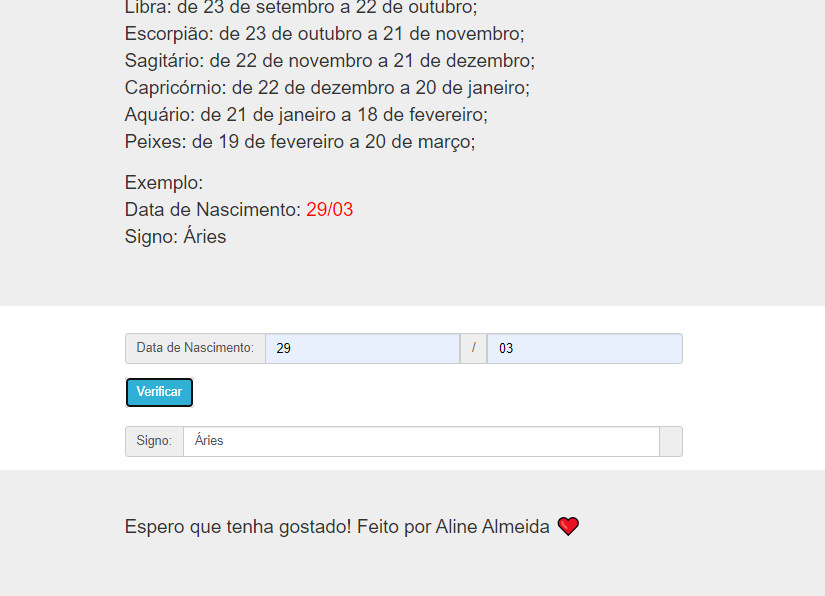

# Jovens Tegranos Exercicio 25

# 🏁 **Tópicos**

 * 👉 Banner
 * 👉 Título e Descrição
 * 👉 Status do Projeto
 * 👉 Funcionalidades
 * 👉 Demonstração da aplicação
 * 👉 Pré-requisitos
 * 👉 Tecnologias utilizadas
 * 👉 Autor
 * 👉 Licença
 
 ____________________________________________________________
# ✅ Banner 👌

<h1 align="center">
  
</h1>

# ✅ Título e Descrição 👌

### Exercicio 25

#### Receber valores numéricos para o dia e o mês de nascimento de uma pessoa; Exibir o signo da pessoa de acordo com os seguintes critérios:

        Áries: de 21 de março a 20 de abril;
        Touro: de 21 de abril a 20 de maio;
        Gêmeos: de 21 de maio a 20 de junho;
        Câncer: de 21 de junho a 22 de julho;
        Leão: de 23 de julho a 22 de agosto;
        Virgem: de 23 de agosto a 22 de setembro;
        Libra: de 23 de setembro a 22 de outubro;
        Escorpião: de 23 de outubro a 21 de novembro;
        Sagitário: de 22 de novembro a 21 de dezembro;
        Capricórnio: de 22 de dezembro a 20 de janeiro;
        Aquário: de 21 de janeiro a 18 de fevereiro;
        Peixes: de 19 de fevereiro a 20 de março;

            Exemplo:
            Data de Nascimento: 29/03
            Signo: Áries
       

# ✅ Status do Projeto 👌

### 🚧 Projeto 🚀 **Concluído com Sucesso!!!** 👌 🚧

# ✅ Funcionalidades 👌

### - [x] Receber valores numéricos para o dia e o mês de nascimento de uma pessoa.
### - [x] Exibir o signo da pessoa.

# ✅ Demonstração da aplicação 👌

<h1 align="center">
  
</h1>

### GitHub AlineAlmeida85

### Link: [Projeto]()

# ✅ Pré-requisitos 👌

### Nenhum, basta clicar no link acima

# ✅ Tecnologias utilizadas ⚒️ 👌

### As seguintes tecnologias foram usadas na construção do projeto:

- [HTML](https://pt.wikipedia.org/wiki/HTML)
- [CSS](https://pt.wikipedia.org/wiki/Cascading_Style_Sheets)
- [JavaScript](https://www.javascript.com/)
- [Lógica de Programação]()

# ✅ Autor 👌

### Aline Almeida 💝

# ✅ Licença

### Não Possui

#### Espero que te agrade! ❤️

